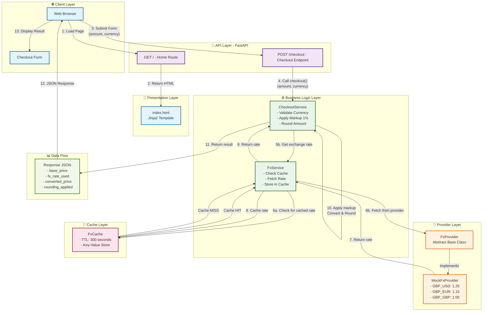

# Multi-Currency Checkout System - Architecture Diagram

## System Architecture



## Layer Overview

### 1. **Client Layer** 🌐
- **Web Browser**: Client application
- **Checkout Form**: User interface for entering amount and currency

### 2. **API Layer** 📡
- **FastAPI Framework**: Modern web framework for building APIs
- **GET /**: Serves home page with HTML template
- **POST /checkout**: Processes currency conversion requests

### 3. **Presentation Layer** 📄
- **index.html**: Jinja2 template rendering the checkout form interface

### 4. **Business Logic Layer** ⚙️
- **CheckoutService**: 
  - Validates currency (allowed: GBP, USD, EUR)
  - Applies 1% markup to exchange rate
  - Rounds converted amount to 2 decimal places
  
- **FxService**: 
  - Checks cache for exchange rates
  - Fetches rates from provider if not cached
  - Stores rates in cache for reuse

### 5. **Provider Layer** 🔌
- **FxProvider**: Abstract base class defining the exchange rate provider interface
- **MockFxProvider**: Concrete implementation with hardcoded rates:
  - GBP → USD: 1.25
  - GBP → EUR: 1.15
  - GBP → GBP: 1.00
  
*Extensible design allows replacing MockFxProvider with real external providers*

### 6. **Cache Layer** 💾
- **FxCache**: In-memory time-to-live (TTL) cache
  - Default TTL: 300 seconds (5 minutes)
  - Key format: `BASE_TARGET` (e.g., `GBP_USD`)
  - Prevents redundant provider calls for the same currency pairs

## Data Flow

1. **Client Request**: Browser submits checkout form with amount and currency
2. **API Routing**: FastAPI receives POST request to `/checkout` endpoint
3. **Validation**: CheckoutService validates the requested currency
4. **Rate Lookup**: CheckoutService requests exchange rate from FxService
5. **Cache Check**: FxService checks if rate is already cached
6. **Provider Fetch**: If cache miss, FxService fetches rate from FxProvider
7. **Cache Store**: Rate is stored in FxCache with TTL
8. **Conversion**: CheckoutService applies 1% markup and converts amount
9. **Rounding**: Amount is rounded to 2 decimal places (HALF_UP)
10. **Response**: JSON response with base price, rate used, converted price, and rounding difference
11. **Display**: Browser renders the conversion result to user

## Project Structure

```
multi_currency_checkout_with_ui/
├── app/
│   ├── main.py                 # FastAPI application entry point
│   ├── cache/
│   │   └── fx_cache.py         # FxCache implementation
│   ├── providers/
│   │   ├── base.py             # FxProvider abstract base class
│   │   └── mock_provider.py    # MockFxProvider implementation
│   ├── services/
│   │   ├── checkout_service.py # CheckoutService implementation
│   │   └── fx_service.py       # FxService implementation
│   └── templates/
│       └── index.html          # Checkout form template
├── tests/
│   └── test_checkout.py        # Test suite
├── requirements.txt            # Python dependencies
└── ARCHITECTURE.md             # This file
```

## Key Design Patterns

### Dependency Injection
All services receive their dependencies via constructor, making them testable and flexible:
```python
fx_service = FxService(provider, cache)
checkout_service = CheckoutService(fx_service)
```

### Abstract Base Classes
`FxProvider` defines the contract for exchange rate providers, allowing easy swapping of implementations:
```python
class FxProvider(ABC):
    @abstractmethod
    def get_rate(self, base: str, target: str) -> Decimal:
        pass
```

### Caching Strategy
TTL-based caching reduces external provider calls while ensuring data freshness:
- Cache validates expiry before returning cached values
- Automatic cleanup of expired entries

### Layered Architecture
Clear separation of concerns:
- **API Layer**: HTTP handling
- **Service Layer**: Business logic
- **Provider Layer**: External data sources
- **Cache Layer**: Performance optimization

## Extension Points

To integrate a real FX provider (e.g., external API):

1. Create a new provider class extending `FxProvider`:
```python
class RealFxProvider(FxProvider):
    def get_rate(self, base: str, target: str) -> Decimal:
        # Call real API
        pass
```

2. Swap the provider in `main.py`:
```python
provider = RealFxProvider()  # Instead of MockFxProvider()
```

The rest of the system remains unchanged due to abstraction!
